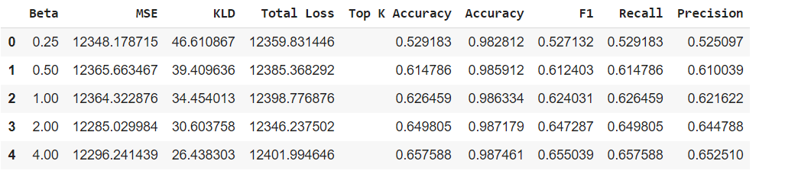

# 11785 final project - Unsupervised Scene Detection in Anime
> This is a deep learning project on Unsupervised Scene Detection in Anime. Scene detection is a task that consists of partitioning video frames into different scenes. Within film-making and video production, a scene can be defined as a series of consecutive frames that are semantically related, which means they are continuous in terms of the event, topic, time, place, or object(s) that they display. This project will enable content creators and media providers to create better automatic scene detection methods, which has the potential of saving animators tremendous effort and time otherwise used in manually filling in between frames.

Our methodology involves training and validating a variational autoencoder using cross validation. We implement a beta-VAE model to identify scene changes. 

## Built with
- Pytorch


## Model
```bash
    BetaVAE_H(
        (encoder): Sequential(
            (0): Conv2d(3, 32, kernel_size=(4, 4), stride=(2, 2), padding=(1, 1))
            (1): ReLU(inplace=True)
            (2): Conv2d(32, 32, kernel_size=(4, 4), stride=(2, 2), padding=(1, 1))
            (3): ReLU(inplace=True)
            (4): Conv2d(32, 64, kernel_size=(4, 4), stride=(2, 2), padding=(1, 1))
            (5): ReLU(inplace=True)
            (6): Conv2d(64, 64, kernel_size=(4, 4), stride=(2, 2), padding=(1, 1))
            (7): ReLU(inplace=True)
            (8): Conv2d(64, 256, kernel_size=(4, 4), stride=(1, 1))
            (9): ReLU(inplace=True)
            (10): View()
            (11): Linear(in_features=256, out_features=20, bias=True)
        )
        (decoder): Sequential(
            (0): Linear(in_features=10, out_features=256, bias=True)
            (1): View()
            (2): ReLU(inplace=True)
            (3): ConvTranspose2d(256, 64, kernel_size=(4, 4), stride=(1, 1))
            (4): ReLU(inplace=True)
            (5): ConvTranspose2d(64, 64, kernel_size=(4, 4), stride=(2, 2), padding=(1, 1))
            (6): ReLU(inplace=True)
            (7): ConvTranspose2d(64, 32, kernel_size=(4, 4), stride=(2, 2), padding=(1, 1))
            (8): ReLU(inplace=True)
            (9): ConvTranspose2d(32, 32, kernel_size=(4, 4), stride=(2, 2), padding=(1, 1))
            (10): ReLU(inplace=True)
            (11): ConvTranspose2d(32, 3, kernel_size=(4, 4), stride=(2, 2), padding=(1, 1))
        )
    )
```

## Results




## Authors

- Abdul-Kazeem Shamba (Andrew_id - ashamba)
- Daniel Wesego (Andrew_id - dwesego)

## Adopted from

- This implementation is based on the implementation of beta-vae by https://github.com/1Konny/Beta-VAE
